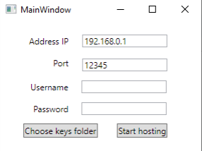
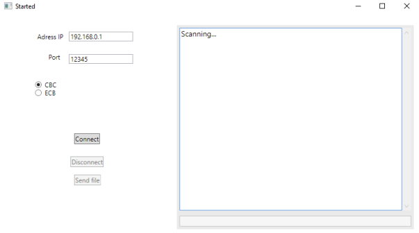
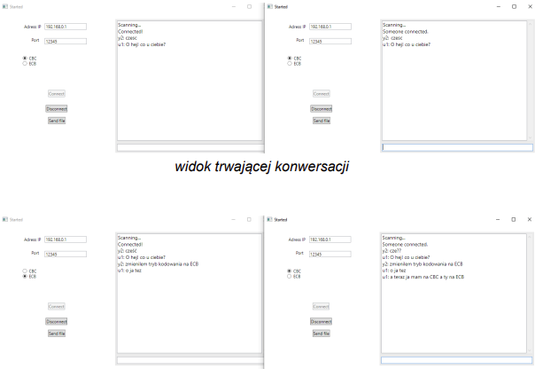
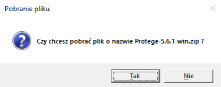
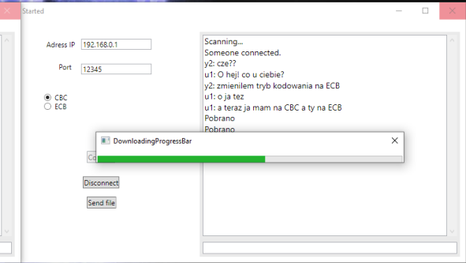

# ChatApplication

WPF application in C# that allows to encrypted communication between two persons, using sockets and TCP protocol.

Cryptosystem methods for safe data transfer:
    * RSA
    * AES
    * SHA-256
    * MD5

Application allows to send text message and files (any size).

Initial window

Scanning state, waiting for incomming connetions

Chatting

Incoming file acceptation dialog

Downloading file progress

Literature
[1] https://learn.microsoft.com/pl-pl/dotnet/api/system.net.sockets.socket?view=net-7.0
[2] https://pl.wikipedia.org/wiki/Gniazdo_(telekomunikacja)