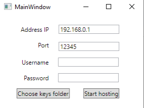
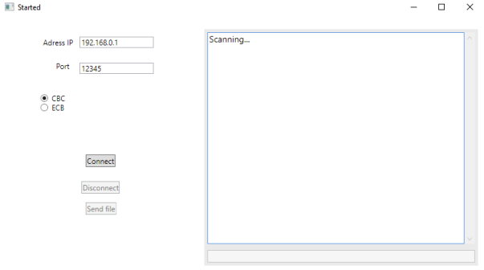
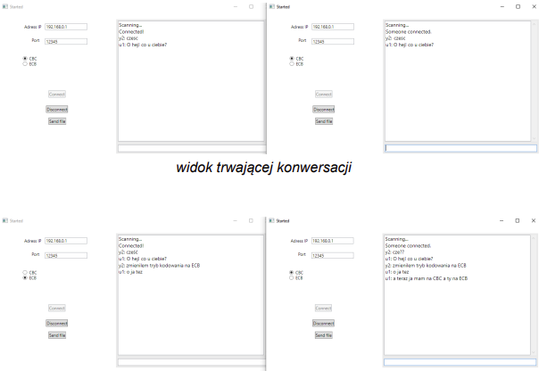
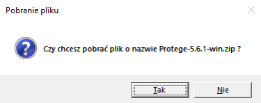
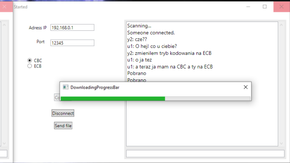

# ChatApplication

WPF application in C# that allows to encrypted communication between two persons, using sockets and TCP protocol.

Cryptosystem methods for safe data transfer:
<ul>
    <li>* RSA</li>
    <li>* AES</li>
    <li>* SHA-256</li>
    <li>* MD5</li>
</ul>
Application allows to send text message and files (any size).  

Initial window 

Scanning state, waiting for incomming connetions 

Chatting 

Incoming file acceptation dialog 

Downloading file progress 

Literature 
[1] https://learn.microsoft.com/pl-pl/dotnet/api/system.net.sockets.socket?view=net-7.0 
[2] https://pl.wikipedia.org/wiki/Gniazdo_(telekomunikacja)